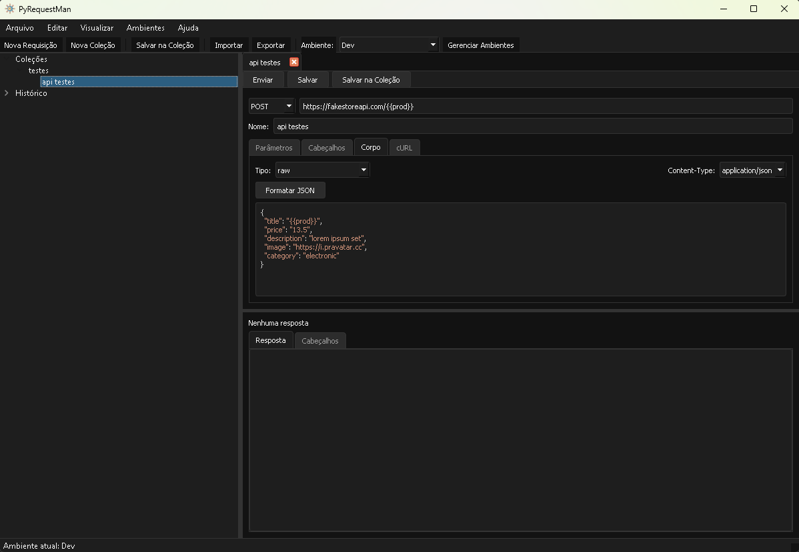

# PyRequestMan - Cliente HTTP em Python

Um cliente HTTP similar ao Postman e Insomnia, desenvolvido inteiramente em Python. Esta aplicação permite testar APIs REST de forma simples e intuitiva, sem necessidade de conexão com serviços externos.



## Funcionalidades

### Requisições HTTP
- Suporte para todos os métodos HTTP (GET, POST, PUT, DELETE, PATCH, HEAD, OPTIONS)
- Configuração de URL, cabeçalhos, parâmetros e corpo da requisição
- Visualização formatada de respostas (JSON, XML, HTML, texto)
- Histórico automático de requisições enviadas

### Gerenciamento de Coleções
- Criação e organização de coleções de requisições
- Estrutura hierárquica com pastas e subpastas
- Importação e exportação de coleções nos formatos:
  - Postman (v2.1)
  - Insomnia (v4)
- Duplicação e compartilhamento de requisições

### Variáveis e Ambientes
- Criação de múltiplos ambientes (dev, staging, produção)
- Definição e gerenciamento de variáveis
- Substituição automática de variáveis em URLs, cabeçalhos e corpo
- Alternância rápida entre ambientes

### Integração com cURL
- Conversão de requisições para comandos cURL
- Importação de comandos cURL para criar novas requisições
- Compartilhamento fácil de requisições via linha de comando

### Interface Personalizada
- Tema claro e escuro
- Interface intuitiva similar ao Postman/Insomnia
- Suporte para abas múltiplas de requisições
- Editores de sintaxe para JSON e outros formatos

### Persistência Local
- Armazenamento local de coleções, requisições e ambientes
- Funcionamento totalmente offline
- Sem necessidade de criar conta ou login

### Portabilidade
- Disponível como executável portátil para Windows
- Sem necessidade de instalação
- Opção de distribuição como aplicativo Python multiplataforma

## Requisitos

### Para Executar o Código-Fonte:
- Python 3.7 ou superior
- Dependências listadas em `requirements.txt`

### Para Execução Portátil:
- Windows 7/8/10/11
- Sem requisitos adicionais (executável standalone)

## Instalação

### Como Aplicação Python:

1. Clone este repositório ou baixe os arquivos
2. Instale as dependências:

```
pip install -r requirements.txt
```

3. Execute a aplicação:

```
python main.py
```

### Como Aplicação Portátil:

1. Baixe o arquivo `PyRequestMan_Portable.zip` da seção de releases
2. Extraia o conteúdo para qualquer pasta
3. Execute o arquivo `PyRequestMan.exe`

## Compilando o Executável

O projeto inclui um script para gerar o executável portátil:

```
python build.py
```

Para criar também o pacote ZIP portátil:

```
python build.py --portable
```

## Estrutura do Projeto

- `/src` - Código-fonte da aplicação
  - `/ui` - Componentes da interface gráfica
    - `main_window.py` - Janela principal e gerenciamento de coleções
    - `request_tab.py` - Interface para criação e envio de requisições
    - `collection_tree_model.py` - Modelo para a visualização hierárquica
    - `environment_dialog.py` - Gerenciamento de ambientes e variáveis
  - `/core` - Lógica de negócio
    - `storage.py` - Sistema de armazenamento local
  - `/models` - Modelos de dados
    - `request.py` - Modelo para requisições e respostas HTTP
    - `collection.py` - Modelo para coleções e pastas
    - `environment.py` - Modelo para ambientes e variáveis
  - `/utils` - Funções utilitárias
    - `curl_converter.py` - Conversão de/para comandos cURL
    - `collection_converter.py` - Importação/exportação de coleções

## Comandos Úteis

- **Limpar histórico:** Menu Editar → Limpar Histórico
- **Importar coleção:** Menu Arquivo → Importar
- **Exportar coleção:** Menu Arquivo → Exportar
- **Alternar tema:** Menu Visualizar → Tema
- **Copiar como cURL:** Botão direito em uma requisição ou aba → Copiar como cURL

## Contribuindo

Contribuições são bem-vindas! Sinta-se à vontade para abrir issues ou enviar pull requests.

1. Faça um fork do projeto
2. Crie sua branch de recurso (`git checkout -b feature/nova-funcionalidade`)
3. Commit suas alterações (`git commit -m 'Adiciona nova funcionalidade'`)
4. Push para a branch (`git push origin feature/nova-funcionalidade`)
5. Abra um Pull Request

## Licença

Este projeto é distribuído sob a licença MIT.

## Agradecimentos

- Inspirado pelos aplicativos [Postman](https://www.postman.com/) e [Insomnia](https://insomnia.rest/)
- Desenvolvido com [PyQt5](https://www.riverbankcomputing.com/software/pyqt/) 